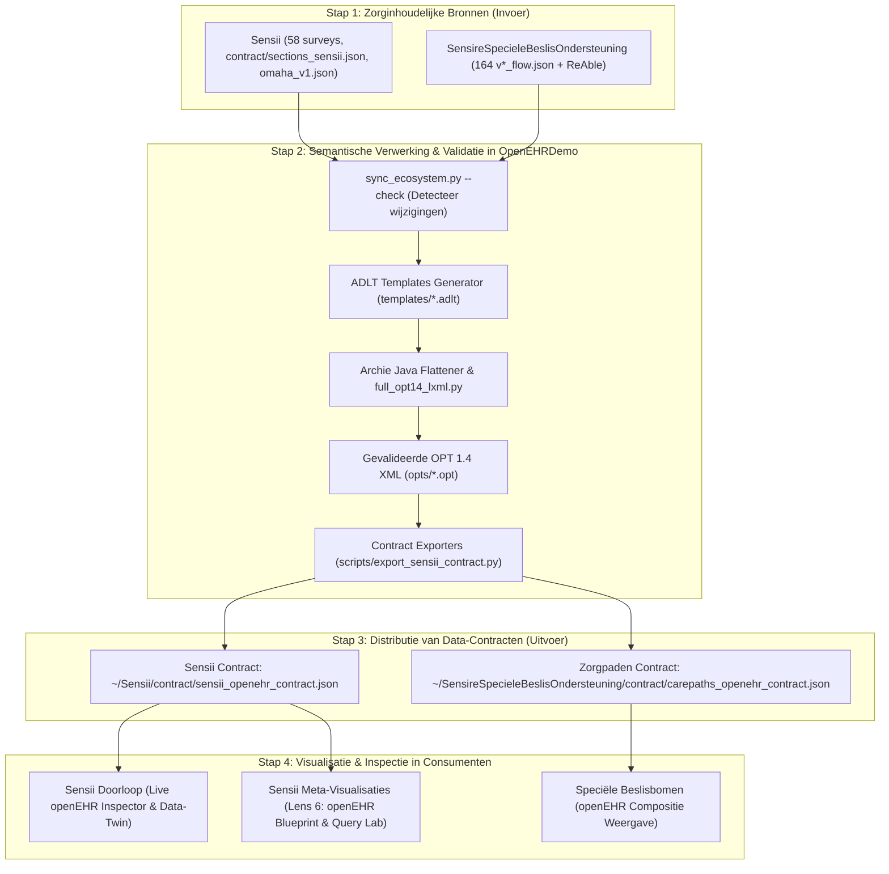

# Digitaal Ecosysteem Governance: Sensire openEHR, Sensii & Zorgpaden

> **Status**: Vastgesteld Architectuur- en Samenwerkingsmodel  
> **Toepassingsgebied**: `~/OpenEHRDemo`, `~/Sensii`, `~/SensireSpecieleBeslisOndersteuning`  
> **Doel**: Garandeert dat wijzigingen in zorginhoudelijke bronnen direct leiden tot gevalideerde openEHR-modellen, en dat consumenten-applicaties (Sensii & Speciële Beslisbomen) uitsluitend gevalideerde openEHR-contracten visualiseren.

---

## 1. De Drie Repositories & Hun Onveranderlijke Rol

```
┌─────────────────────────────────────────────────────────────────────────────────────────┐
│                        SENSIRE OPEN-EHR DIGITAAL ECOSYSTEEM                              │
├─────────────────────────────┬─────────────────────────────┬─────────────────────────────┤
│ 1. SpecieleBeslisOnderst... │ 2. Sensii                   │ 3. OpenEHRDemo              │
│    (Klinische Bron)         │    (Wijkverpleegkundig EPD) │    (De Semantische Fabriek) │
├─────────────────────────────┼─────────────────────────────┼─────────────────────────────┤
│ • 164 Zorgpaden (Mermaids)  │ • 58 Wijkverpleegkundige    │ • 730+ CKM & Custom         │
│ • v*_flow.json definities   │   surveys & SFP beslismotor │   Archetypes (ADL 1.4/2)    │
│ • ReAble varianten          │ • Levensverhaal & VAG       │ • Archie Java Compilatie    │
│ • Consument van openEHR     │ • 11 Gordon patronen & GFI  │ • OPT 1.4 XML Generator     │
│   zorgpaden-contract        │ • Omaha probleemclassific.  │ • Terminologiecascade       │
│                             │ • Consument van Sensii      │ • Producent van Data-       │
│                             │   openEHR contract          │   Contracten (JSON)         │
└─────────────────────────────┴─────────────────────────────┴─────────────────────────────┘
```

---

## 2. De Afhankelijkheids- en Datastroom

De stroom van zorginhoud naar openEHR en terug naar visualisatie is strikt **unidirectioneel**:



---

## 3. De 4 Gouden Regels van het Ecosysteem

1. **Geen Handmatige openEHR Constructies in Consumenten**:
   - `Sensii` en `SensireSpecieleBeslisOndersteuning` definiëren **nooit** zelf openEHR archetypes, OPT's of AQL-queries in code. Ze lezen uitsluitend de door `OpenEHRDemo` gegenereerde JSON-contracten in.
2. **`OpenEHRDemo` is de Single Source of Truth (SSOT) voor Semantiek**:
   - Alle archetypes (`archetypes/`), templates (`templates/`), OPT 1.4 XML bestanden (`opts/`), en de Terminologiecascade (`TERMINOLOGIE_CASCADE.md`) worden uitsluitend hier beheerd en gecompileerd.
3. **Inhoud Gewijzigd = Opnieuw Controleren & Genereren**:
   - Wanneer een flow in `SensireSpecieleBeslisOndersteuning` of een survey in `Sensii` wijzigt, wordt `python3 scripts/sync_ecosystem.py --build` uitgevoerd in `OpenEHRDemo`.
4. **Contract-Integriteit & Test-Borging**:
   - De gegenereerde contracten bevatten een `schema_version`, `timestamp` en `sha256_checksum`.
   - In `Sensii` controleert een automatische test (`tests/test_openehr_contract.*`) of alle formulieren gedekt zijn door het contract.

---

## 4. De Uitvoerbare Sync- & CI/CD Commando's

Vanuit `OpenEHRDemo` draaien de volgende deterministische commando's:

```bash
# 1. Controleer of openEHR synchroon loopt met de bronnen in Sensii en Speciële Zorgpaden:
python3 scripts/sync_ecosystem.py --check

# 2. Genereer en hercompileer alle gewijzigde archetypes, OPTs en exporteer de contracten:
python3 scripts/sync_ecosystem.py --build

# 3. Exporteer uitsluitend het Sensii contract naar ~/Sensii/contract/:
python3 scripts/export_sensii_contract.py
```

---

## 5. Change Workflows: Wat te doen bij een wijziging?

### Scenario A: Een wijkverpleegkundige/redacteur wijzigt een vraag in Sensii
1. Pas de vraag/survey aan in `~/Sensii`.
2. Open `~/OpenEHRDemo` en voer uit: `python3 scripts/sync_ecosystem.py --build`.
3. Het script past eventueel het ADLT-template aan, hercompileert de OPT 1.4 XML, en update `sensii_openehr_contract.json`.
4. In `Sensii` is de nieuwe vraag direct zichtbaar in de doorloop mét de juiste openEHR-badge en data-element mapping.

### Scenario B: Een specialist voegt een ReAble-variant toe aan een Zorgpad
1. Plaats de nieuwe flow in `~/SensireSpecieleBeslisOndersteuning/ReAble/`.
2. Open `~/OpenEHRDemo` en voer uit: `python3 scripts/sync_ecosystem.py --build`.
3. De pipeline herkent de ReAble-flow, genereert het template met `ACTION.health_education` en compileert de OPT.
4. De speciële beslisboom toont direct de openEHR ReAble-status.

### Scenario C: Een landelijke ZIB of SNOMED-code wijzigt
1. Werk het archetype of terminologie-tabel bij in `~/OpenEHRDemo/archetypes/` conform `TERMINOLOGIE_CASCADE.md`.
2. Voer `python3 scripts/sync_ecosystem.py --build` uit.
3. Alle contracten en OPTs worden opnieuw gevalideerd en gedistribueerd.
