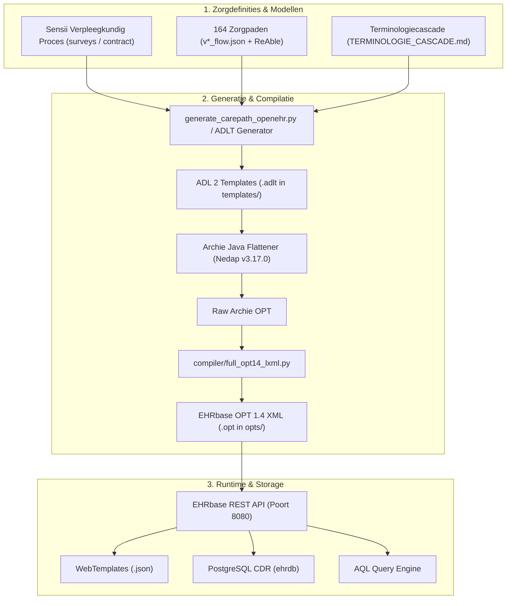

# MetaDocumentatie OpenEHR Demo & Zorgpaden Pipeline

> **Doel**: Dit document dient als de centrale, persistente kennisbank en architectuurhandleiding voor het Sensire OpenEHR Demo project. Het beschrijft alle technische principes, geleerde lessen, opgeloste knelpunten en instructies voor het converteren, compileren, uploaden en bevragen van het **Sensii Integraal Verpleegkundig Proces** en de **164 specialistische en ReAble zorgpaden**.

---

## 1. Projectcontext & Doelstelling

Sensire beschikt over:
1. **Sensii Integraal Verpleegkundig Dossier** (`~/Sensii`): Het integrale wijkverpleegkundige proces van intake tot evaluatie volgens de V&VN-standaarden en de Omaha Systematiek (58 surveys verdeeld over 4 klinische hoofdstukken).
2. **164 Specialistische Zorgpaden** (`~/SensireSpecieleBeslisOndersteuning/4.Mermaids/`): 148 reguliere en 16 ReAble-geactiveerde zorgpaden met beslisbomen, metingen, verpleegkundige handelingen, triagecriteria en arts-escalaties.

Het doel van deze codebase is:
1. Volautomatisch modelleren en converteren van het gehele zorglandschap naar internationaal gevalideerde **openEHR ADL 2 templates (`.adlt`)**.
2. Compileren naar officiële **openEHR OPT 1.4 XML (`.opt`)** die 100% compliant zijn met EHRbase.
3. Hanteren van een strikte **Terminologiecascade** (ZIBs → SNOMED CT NL → openEHR CKM → V&VN → Zorgpad Fallback).
4. Uploaden naar de **EHRbase CDR** (Clinical Data Repository) en exporteren van **WebTemplate JSON schema's**.
5. Inlezen van **FLAT JSON composities** en bevragen via **AQL (Archetype Query Language)**.

---

## 2. Systeemarchitectuur & Pipeline

De architectuur volgt een robuuste **hybride pipeline**:



### Belangrijkste Componenten:

1. **Archetype Catalogus ([`archetypes/`](file:///home/vlieger/OpenEHRDemo/archetypes))**:
   - Bevat 730+ internationale (CKM) en maatwerk archetypes.
   - Bevat 7 specifieke Sensii en Nederlandse zorgproces archetypes in [`archetypes/custom/`](file:///home/vlieger/OpenEHRDemo/archetypes/custom/):
     - `OBSERVATION.groningen_frailty_indicator_nl.v0` (GFI score 0-15)
     - `OBSERVATION.self_management_regietrede_nl.v0` (Regietrede 1-5, draagkracht/last, motoradvies vs oordeel)
     - `EVALUATION.omaha_assessment_nl.v0` (Omaha probleemclassificatie, KBS schalen, 4 actiesoorten)
     - `OBSERVATION.nursing_gordon_patterns_nl.v0` (11 Gezondheidspatronen van Gordon)
     - `EVALUATION.triage_nursing_nl.v0` (Wijkverpleegkundige triage)
     - `EVALUATION.nursing_vag_nl.v0` (Verpleegkundig Adviesgesprek VAG)
     - `ADMIN_ENTRY.care_funding_delivery_nl.v0` (Financiering Zvw/Wlz/Wmo, ZIN/PGB/VPT/MPT)
   - Tweetalig uitgerust (`["nl"]` primair, `["en"]` vertaling).

2. **Sensii Template Suite ([`templates/`](file:///home/vlieger/OpenEHRDemo/templates) & [`opts/`](file:///home/vlieger/OpenEHRDemo/opts/))**:
   - `sensire_sensii_h1_intake_triage_vag.v1` (Hoofdstuk 1: Wie deze cliënt is)
   - `sensire_sensii_h2_anamnese_diagnostiek.v1` (Hoofdstuk 2: Wat er speelt)
   - `sensire_sensii_h3_zorgplan_inzet.v1` (Hoofdstuk 3: Wat we gaan doen & Zorgplan)
   - `sensire_sensii_h4_evaluatie.v1` (Hoofdstuk 4: Evaluatie van zorg)
   - `sensire_sensii_verpleegkundig_proces_integraal.v1` (Het Integrale Sensii Dossier)

3. **Speciële Zorgpaden Pipeline ([`scripts/generate_carepath_openehr.py`](file:///home/vlieger/OpenEHRDemo/scripts/generate_carepath_openehr.py))**:
   - Leest de 164 JSON flows in, selecteert archetypes, genereert ADLT templates (inclusief `_reable` varianten met `ACTION.health_education` en `INSTRUCTION.care_plan_request`), compileert via Archie en valideert OPT 1.4 XML.

4. **Archie Java Flattener ([`compiler/src/main/java/nl/sensire/openehr/OPTGenerator.java`](file:///home/vlieger/OpenEHRDemo/compiler/src/main/java/nl/sensire/openehr/OPTGenerator.java))**:
   - Gebruikt Nedap Archie (v3.17.0) om ADL 2 templates te combineren met onderliggende archetypes tot een gevlakt Operational Template.

5. **OPT 1.4 Postprocessor ([`compiler/full_opt14_lxml.py`](file:///home/vlieger/OpenEHRDemo/compiler/full_opt14_lxml.py))**:
   - Converteert Archie XML naar strikte EHRbase OPT 1.4 XML (herstructurering van namespaces, `occurrences`, verplichte RM `category` codering en node mappings).

6. **Terminologiebeleid ([`TERMINOLOGIE_CASCADE.md`](file:///home/vlieger/OpenEHRDemo/TERMINOLOGIE_CASCADE.md))**:
   - Vastgelegde 5-staps cascade: 1. Nictiz ZIBs → 2. SNOMED CT NL → 3. openEHR CKM → 4. V&VN / Omaha NL → 5. Zorgpad Fallback.

---

## 3. Cruciale Technische Kennis & Opgeloste Knelpunten

### A. RM Type Mapping in ADL 2 Templates
In ADL 2 templates mogen `use_archetype` regels **alleen** officiële openEHR Reference Model (RM) typenamen gebruiken:
- **Juist**: `use_archetype EVALUATION[id2, openEHR-EHR-EVALUATION.problem_diagnosis.v1]`
- **Onjuist**: `use_archetype PROBLEM_DIAGNOSIS[id2, ...]` (leidt tot parserfouten).
- **Regel**: Extraheer het RM-type uit de archetype ID via `arch.split('-')[2].split('.')[0]`.

### B. Het `category` Attribuut in OPT 1.4 XML
EHRbase eist op Composition-niveau een expliciet `category` attribuut conform openEHR RM:
- `rm_attribute_name` moet een child element zijn (`<rm_attribute_name>category</rm_attribute_name>`).
- Type moet `C_SINGLE_ATTRIBUTE` zijn met existence `[1..1]`.
- Child moet `DV_CODED_TEXT` zijn met defining_code `C_TERMINOLOGY_CODE` constraint `[openehr::433]` (event).
- In FLAT JSON composities moet `contact/category|code` = `433`, `contact/category|value` = `event`, en `contact/category|terminology` = `openehr` worden meegegeven.

### C. WebTemplate Header Eisen
Bij het ophalen van WebTemplates via de EHRbase REST API (`/definition/template/adl1.4/{templateId}`) moet de HTTP header strikt zijn ingesteld op:
- `Accept: application/openehr.wt+json` (standaard `application/json` wordt geweigerd met HTTP 500/406).

### D. ReAble Zorgpad Transformatie
ReAble-varianten transformeren een speciële zorgpad-compositie door toevoeging van:
- `ACTION.health_education.v1`: Begeleiding naar zelfstandigheid en mantelzorginstructie.
- `INSTRUCTION.care_plan_request.v0`: Zelfzorgdoelen en afbouwschema's.
- `EVALUATION.clinical_synopsis.v1`: Evaluatie van zelfredzaamheidsgroei.

---

## 4. Bestandsstructuur & Referentie-index

| Map / Bestand | Doel / Inhoud |
| :--- | :--- |
| [`docs/SENSII_OPENEHR_MAPPING.md`](file:///home/vlieger/OpenEHRDemo/docs/SENSII_OPENEHR_MAPPING.md) | **Architectuur Sensii**: Volledige mapping van Sensii hoofdstukken 1-4, Omaha koppeling en datastromen. |
| [`TERMINOLOGIE_CASCADE.md`](file:///home/vlieger/OpenEHRDemo/TERMINOLOGIE_CASCADE.md) | **Terminologiebeleid**: 5-staps terminologiecascade voor Nederlandse vertalingen en SNOMED CT bindings. |
| [`scripts/generate_carepath_openehr.py`](file:///home/vlieger/OpenEHRDemo/scripts/generate_carepath_openehr.py) | **Hoofdscript**: Automatische end-to-end generator voor 164 zorgpaden (regulier & ReAble). |
| [`scripts/search_archetypes.py`](file:///home/vlieger/OpenEHRDemo/scripts/search_archetypes.py) | CLI zoektool voor lokale openEHR archetypes op trefwoord. |
| [`scripts/index_archetypes.py`](file:///home/vlieger/OpenEHRDemo/scripts/index_archetypes.py) | Script dat alle 730+ ADL archetypes indexeert naar catalogus JSON. |
| [`compiler/full_opt14_lxml.py`](file:///home/vlieger/OpenEHRDemo/compiler/full_opt14_lxml.py) | Python XML postprocessor voor OPT 1.4 conformiteit. |
| [`compiler/src/main/java/nl/sensire/openehr/OPTGenerator.java`](file:///home/vlieger/OpenEHRDemo/compiler/src/main/java/nl/sensire/openehr/OPTGenerator.java) | Nedap Archie Java wrapper voor flattener en validatie. |
| [`templates/`](file:///home/vlieger/OpenEHRDemo/templates) | Bevat alle gegenereerde openEHR ADL 2 templatebronnen (`.adlt`). |
| [`opts/`](file:///home/vlieger/OpenEHRDemo/opts) | Bevat alle gecompileerde openEHR OPT 1.4 XML bestanden (`.opt`). |
| [`archetypes/custom/`](file:///home/vlieger/OpenEHRDemo/archetypes/custom) | Bevat Sensii en Nederlandse maatwerk-archetypes (GFI, Regietrede, Omaha, Gordon, Triage, VAG, Financiering). |
| [`docker-compose.yml`](file:///home/vlieger/OpenEHRDemo/docker-compose.yml) | Docker stack definitie (EHRbase, PostgreSQL, pgAdmin, GDL2). |

---

## 5. Operationele Handleiding (Runbook)

### 1. De omgeving starten
```bash
./start_env.sh
```
Controleer of EHRbase actief is via:
```bash
curl -s -u ehrbase-user:SuperSecretPassword http://localhost:8080/ehrbase/rest/status
```

### 2. Eén zorgpad converteren en testen
```bash
python3 scripts/generate_carepath_openehr.py C1
```

### 3. Alle 164 zorgpaden in batch verwerken (regulier + ReAble)
```bash
python3 scripts/generate_carepath_openehr.py --all
```

### 4. Sensii templates compileren
```bash
cd compiler && ./gradlew generateOPT
python3 -c "
import subprocess, sys
from pathlib import Path
repo = Path('/home/vlieger/OpenEHRDemo')
for adlt in repo.glob('templates/sensire_sensii_*.adlt'):
    opt = repo / 'opts' / f'{adlt.stem}.opt'
    subprocess.run([sys.executable, str(repo / 'compiler' / 'full_opt14_lxml.py'), str(opt), str(opt), str(adlt)])
"
```

---

## 6. Omgaan met Redactiewijzigingen in Zorgpaden (CI/CD)

Wanneer redacteuren een flow aanpassen in `~/SensireSpecieleBeslisOndersteuning/4.Mermaids/<MODULE>/v*_flow.json` of een ReAble variant toevoegen in `~/SensireSpecieleBeslisOndersteuning/ReAble/`:
1. Voer `python3 scripts/generate_carepath_openehr.py <MODULE>` uit (of `--all`).
2. Het script herkent de flow, genereert het bijgewerkte ADLT template, hercompileert het OPT 1.4 bestand en synchroniseert het WebTemplate.
3. Bestaande historische composities in EHRbase blijven traceerbaar behouden volgens de openEHR specificaties.
