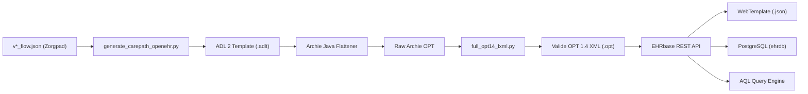

# MetaDocumentatie OpenEHR Demo & Zorgpaden Pipeline

> **Doel**: Dit document dient als de centrale, persistente kennisbank en architectuurhandleiding voor het Sensire OpenEHR Demo project. Het beschrijft alle technische principes, geleerde lessen, opgeloste knelpunten en instructies voor het converteren, compileren, uploaden en bevragen van de 148 klinische zorgpaden.

---

## 1. Projectcontext & Doelstelling

Sensire beschikt over **148 specialistische zorgpaden** (opgeslagen in `~/SensireSpecieleBeslisOndersteuning/4.Mermaids/` als `v*_flow.json` bestanden). Deze zorgpaden bevatten beslisbomen, metingen, verpleegkundige acties, medicatie-interventies en arts-escalaties.

Het doel van deze codebase is:
1. Volautomatisch converteren van elk zorgpad naar een internationaal gevalideerd **openEHR ADL 2 template (`.adlt`)**.
2. Compileren naar een officiële **openEHR OPT 1.4 XML (`.opt`)** die 100% compliant is met EHRbase.
3. Uploaden naar de lokale **EHRbase CDR** (Clinical Data Repository).
4. Exporteren van **WebTemplate JSON schema's** voor frontend-formulieren en doorloop-visualisaties.
5. Inlezen van **FLAT JSON composities** (gestructureerde patiëntendossiers) en bevragen via **AQL (Archetype Query Language)**.

---

## 2. Systeemarchitectuur & Pipeline

De architectuur volgt een robuuste **hybride pipeline**:



### Belangrijkste Componenten:

1. **Archetype Catalogus ([`archetypes/`](file:///home/vlieger/OpenEHRDemo/archetypes))**:
   - Bevat 727+ internationale (CKM) en nationale openEHR archetypes.
   - Geïndexeerd via [`scripts/index_archetypes.py`](file:///home/vlieger/OpenEHRDemo/scripts/index_archetypes.py) naar [`archetypes/archetype_catalog.json`](file:///home/vlieger/OpenEHRDemo/archetypes/archetype_catalog.json).
   - Doorzoekbaar via de CLI: `python3 scripts/search_archetypes.py "<zoekterm>"`.

2. **Template Generator & Batch Pipeline ([`scripts/generate_carepath_openehr.py`](file:///home/vlieger/OpenEHRDemo/scripts/generate_carepath_openehr.py))**:
   - Leest de JSON flows in, analyseert beslisstappen, selecteert passende openEHR archetypes, bouwt het ADLT template, start de Java/Python build en test composities & AQL live.

3. **Archie Java Flattener ([`compiler/src/main/java/nl/sensire/openehr/OPTGenerator.java`](file:///home/vlieger/OpenEHRDemo/compiler/src/main/java/nl/sensire/openehr/OPTGenerator.java))**:
   - Gebruikt Nedap Archie (v3.17.0) om ADL 2 templates te combineren met onderliggende archetypes tot een gevlakt Operational Template.

4. **OPT 1.4 Postprocessor ([`compiler/full_opt14_lxml.py`](file:///home/vlieger/OpenEHRDemo/compiler/full_opt14_lxml.py))**:
   - Converteert Archie XML naar strikte EHRbase OPT 1.4 XML (herstructurering van namespaces, `occurrences`, verplichte RM `category` codering en node mappings).

5. **EHRbase CDR & Database Stack ([`docker-compose.yml`](file:///home/vlieger/OpenEHRDemo/docker-compose.yml))**:
   - **EHRbase CDR**: Draait op poort `8080` (`http://localhost:8080/ehrbase`).
   - **PostgreSQL (ehrdb)**: Draait op poort `5432` voor persistente opslag.
   - **pgAdmin**: Draait op poort `5050` (`demo@sensire.nl` / `demo`).
   - **GDL2 Editor**: Draait op poort `8082` voor Guideline Definition Language beslisregels.

---

## 3. Cruciale Technische Kennis & Opgeloste Knelpunten

Tijdens de realisatie van de pipeline zijn de volgende kritieke openEHR/EHRbase uitdagingen opgelost:

### A. RM Type Mapping in ADL 2 Templates
In ADL 2 templates mogen `use_archetype` regels **alleen** officiële openEHR Reference Model (RM) typenamen gebruiken:
- **Juist**: `use_archetype EVALUATION[id2, openEHR-EHR-EVALUATION.problem_diagnosis.v1]`
- **Onjuist**: `use_archetype PROBLEM_DIAGNOSIS[id2, ...]` (leidt tot 500 fouten in de EHRbase parser).
- **Regel**: Extraheer het RM-type uit de archetype ID via `arch.split('-')[2].split('.')[0]`.

### B. Het `category` Attribuut in OPT 1.4 XML
EHRbase eist op Composition-niveau een expliciet `category` attribuut conform openEHR RM:
- `rm_attribute_name` moet een child element zijn (`<rm_attribute_name>category</rm_attribute_name>`).
- Type moet `C_SINGLE_ATTRIBUTE` zijn met existence [1..1].
- Child moet `DV_CODED_TEXT` zijn met defining_code `C_TERMINOLOGY_CODE` constraint `[openehr::433]` (event).
- In FLAT JSON composities moet `contact/category|code` = `433`, `contact/category|value` = `event`, en `contact/category|terminology` = `openehr` worden meegegeven.

### C. WebTemplate Header Eisen
Bij het ophalen van WebTemplates via de EHRbase REST API (`/definition/template/adl1.4/{templateId}`) moet de HTTP header strikt zijn ingesteld op:
- `Accept: application/openehr.wt+json` (standaard `application/json` wordt geweigerd met HTTP 500/406).

### D. FLAT JSON Ingestion & Context Parameters
Om een compositie succesvol op te slaan in FLAT JSON formaat, moeten verplichte contextvelden altijd aanwezig zijn:
```json
{
  "ctx/language": "nl",
  "ctx/territory": "NL",
  "ctx/composer_name": "Wijkverpleegkundige Sensire",
  "ctx/time": "2026-08-14T18:00:00.000Z",
  "ctx/setting": "227",
  "contact/category|code": "433",
  "contact/category|value": "event",
  "contact/category|terminology": "openehr",
  "contact/probleem_diagnose:0/naam_van_het_probleem_de_diagnose": "...",
  "contact/probleem_diagnose:0/datum_tijd_van_aanvang": "..."
}
```

### E. AQL Querying over Meerdere Zorgpaden
Gestructureerde extractie van diagnosen en besluiten over alle zorgpaden heen gebeurt via:
```sql
SELECT 
    c/archetype_details/template_id/value as template_id,
    c/context/start_time/value as tijdstip,
    p/data[at0001]/items[at0002]/value/value as diagnose,
    s/data[at0001]/items[at0002]/value/value as synopsis
FROM EHR e 
CONTAINS COMPOSITION c 
    CONTAINS (
        EVALUATION p[openEHR-EHR-EVALUATION.problem_diagnosis.v1] and 
        EVALUATION s[openEHR-EHR-EVALUATION.clinical_synopsis.v1]
    )
ORDER BY c/context/start_time/value DESC
```

---

## 4. Bestandsstructuur & Referentie-index

| Map / Bestand | Doel / Inhoud |
| :--- | :--- |
| [`scripts/generate_carepath_openehr.py`](file:///home/vlieger/OpenEHRDemo/scripts/generate_carepath_openehr.py) | **Hoofdscript**: Automatische end-to-end generator (enkelvoudig & batch `--all`). |
| [`scripts/search_archetypes.py`](file:///home/vlieger/OpenEHRDemo/scripts/search_archetypes.py) | CLI zoektool voor lokale openEHR archetypes op trefwoord. |
| [`scripts/index_archetypes.py`](file:///home/vlieger/OpenEHRDemo/scripts/index_archetypes.py) | Script dat alle 727+ ADL archetypes indexeert naar catalogus JSON. |
| [`compiler/full_opt14_lxml.py`](file:///home/vlieger/OpenEHRDemo/compiler/full_opt14_lxml.py) | Python XML postprocessor voor OPT 1.4 conformiteit. |
| [`compiler/src/main/java/nl/sensire/openehr/OPTGenerator.java`](file:///home/vlieger/OpenEHRDemo/compiler/src/main/java/nl/sensire/openehr/OPTGenerator.java) | Nedap Archie Java wrapper voor flattener en validatie. |
| [`templates/`](file:///home/vlieger/OpenEHRDemo/templates) | Bevat alle gegenereerde openEHR ADL 2 templatebronnen (`.adlt`). |
| [`opts/`](file:///home/vlieger/OpenEHRDemo/opts) | Bevat alle gecompileerde openEHR OPT 1.4 XML bestanden (`.opt`). |
| [`frontend/sensire-app/webtemplates/`](file:///home/vlieger/OpenEHRDemo/frontend/sensire-app/webtemplates) | Bevat alle gegenereerde WebTemplate JSON schema's voor frontend UI formulieren. |
| [`docker-compose.yml`](file:///home/vlieger/OpenEHRDemo/docker-compose.yml) | Docker stack definitie (EHRbase, PostgreSQL, pgAdmin, GDL2). |
| [`start_env.sh`](file:///home/vlieger/OpenEHRDemo/start_env.sh) | Opstartscript voor de gehele ontwikkel- en demonstratoromgeving. |

---

## 5. Operationele Handleiding (Runbook)

### 1. De omgeving starten
```bash
./start_env.sh
```
Controleer of EHRbase actief is via:
```bash
curl -s -u ehrbase-user:SuperSecretPassword http://localhost:8080/ehrbase/rest/status
```

### 2. Eén zorgpad converteren en testen
```bash
python3 scripts/generate_carepath_openehr.py C1
```

### 3. Alle 148 zorgpaden in batch verwerken
```bash
python3 scripts/generate_carepath_openehr.py --all
```

### 4. Direct AQL queries uitvoeren
```bash
python3 -c "
import urllib.request, json, base64
auth = 'Basic ' + base64.b64encode(b'ehrbase-user:SuperSecretPassword').decode()
query = 'SELECT c/name/value, c/context/start_time/value FROM EHR e CONTAINS COMPOSITION c LIMIT 5'
req = urllib.request.Request('http://localhost:8080/ehrbase/rest/openehr/v1/query/aql', data=json.dumps({'q': query}).encode(), headers={'Authorization': auth, 'Content-Type': 'application/json'})
with urllib.request.urlopen(req) as r:
    print(json.dumps(json.loads(r.read().decode()), indent=2))
"
```

---

## 6. Omgaan met Redactiewijzigingen in Zorgpaden (CI/CD)

Wanneer redacteuren een flow aanpassen in `~/SensireSpecieleBeslisOndersteuning/4.Mermaids/<MODULE>/v*_flow.json`:
1. Voer `python3 scripts/generate_carepath_openehr.py <MODULE>` uit.
2. Het script herkent de nieuwste `v*_flow.json`, genereert het bijgewerkte ADLT template, hercompileert het OPT 1.4 bestand en synchroniseert het WebTemplate.
3. Bestaande historische composities in EHRbase blijven traceerbaar behouden volgens de openEHR specificaties.
