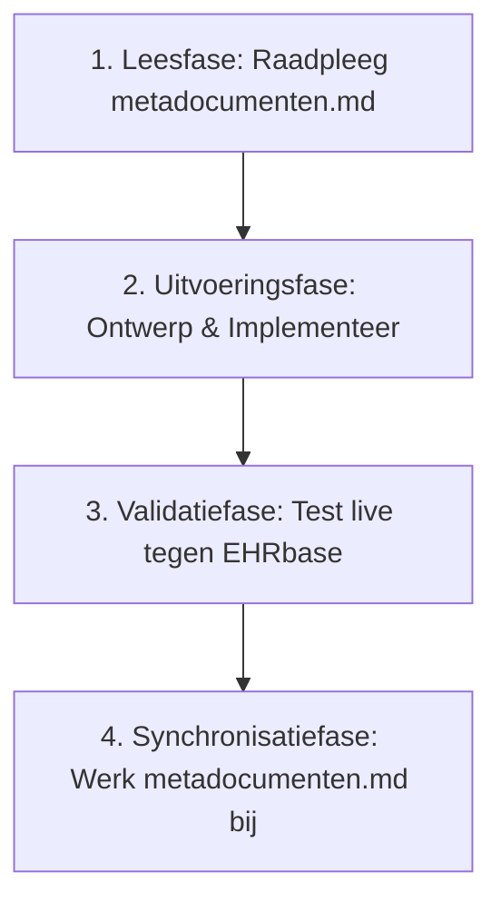

# MetaMeta Protocol & Documentatie-Governance

> **Doel**: Dit document (`metameta.md`) definieert de rol, functie en onderhoudsregels voor [`metadocumenten.md`](file:///home/vlieger/OpenEHRDemo/metadocumenten.md) en alle overige meta-documentatie binnen de OpenEHRDemo repository. Het waarborgt de **"dubbele dekking"** en continuïteit tussen ontwikkelsessies van zowel menselijke ontwikkelaars als AI-assistenten.

---

## 1. Het Principe van "Dubbele Dekking"

AI-modellen en ontwikkelomgevingen kennen context-vensters en sessie-onderbrekingen. Om volledige continuïteit en soevereiniteit over de kennis te garanderen, geldt het principe van **dubbele dekking**:
1. **Sessie-geheugen (Transient)**: Handelingen en analyses tijdens een actieve sessie.
2. **MetaDocumentatie (Persistent & SSOT)**: [`metadocumenten.md`](file:///home/vlieger/OpenEHRDemo/metadocumenten.md) is de **Single Source of Truth (SSOT)** waarin alle architecturele besluiten, technische ontdekkingen, opgeloste bugs en operationele commando's direct in de codebase worden vastgelegd.

Geen enkele cruciale technische beslissing of configuratie mag uitsluitend in chatgeschiedenis blijven hangen; alles moet traceerbaar zijn in de meta-documenten.

---

## 2. De Rol van `metadocumenten.md`

[`metadocumenten.md`](file:///home/vlieger/OpenEHRDemo/metadocumenten.md) fungeert als:
- **Architectuurhandboek**: Gedetailleerde beschrijving van hoe bronbestanden (JSON flows), compilers (Archie & Python postprocessor), templates (ADLT & OPT 1.4) en databases (EHRbase & PostgreSQL) op elkaar aansluiten.
- **Kennis- en Foutenregister**: Een overzicht van specifieke openEHR en EHRbase eigenaardigheden (zoals `category` vereisten, WebTemplate headers, RM typenamen en FLAT formats) inclusief de bewezen oplossingen.
- **Centrale Index**: Verwijzingen met werkende bestandspaden naar alle kernscripts, configuraties en datafolders.
- **Operationeel Runbook**: Eenduidige commando's om de stack te starten, individuele zorgpaden te verwerken of batch-runs uit te voeren.

---

## 3. Verplicht Bijwerk-Protocol bij Elke Handeling

Bij **elke** toekomstige sessie of handeling van een AI-assistent (of ontwikkelaar) moet het volgende 4-stappen protocol worden gevolgd:

### Stap 1: Leesfase (Start van elke taak)
- Lees altijd eerst [`metadocumenten.md`](file:///home/vlieger/OpenEHRDemo/metadocumenten.md) om te weten waar het project staat, welke standaarden gelden en welke valkuilen reeds zijn opgelost.

### Stap 2: Uitvoeringsfase
- Pas code of scripts aan conform de vastgestelde architectuur (bijv. Archie + OPT 1.4 postprocessor via [`compiler/full_opt14_lxml.py`](file:///home/vlieger/OpenEHRDemo/compiler/full_opt14_lxml.py)).

### Stap 3: Validatiefase
- Valideer wijzigingen altijd direct met werkende commando's (compilatie, HTTP upload naar EHRbase, AQL bevraging).

### Stap 4: Synchronisatiefase (Afsluiting van elke taak)
Als tijdens de handeling een van de volgende gebeurtenissen plaatsvindt, **moet** [`metadocumenten.md`](file:///home/vlieger/OpenEHRDemo/metadocumenten.md) direct worden bijgewerkt:
1. **Nieuwe scripts of bestanden toegevoegd**: Voeg het bestand toe aan de tabel in Sectie 4 van `metadocumenten.md`.
2. **Nieuwe technische inzichten / bugfixes**: Documenteer de fout en de exacte oplossing in Sectie 3 (Kennisbank).
3. **Gewijzigde commando's of API-endpoints**: Pas het Runbook aan in Sectie 5.
4. **Uitbreiding van zorgpaden of archetypes**: Update de statistieken en modulelijsten.

---

## 4. Kwaliteitseisen voor Documentatie

Wanneer `metadocumenten.md` of gerelateerde documenten worden bewerkt, gelden de volgende strikte regels:
- **Klikbare links**: Gebruik altijd volledige Markdown file links (bv. `[bestandsnaam.py](file:///home/vlieger/OpenEHRDemo/scripts/bestandsnaam.py)`).
- **Exacte syntax**: Geen pseudo-code; geef exacte bash commando's, JSON structuren en AQL queries.
- **Geen placeholders**: Vermeld echte testresultaten, poorten en endpoint-URL's.
- **Heldere structuur**: Gebruik duidelijke koppen, Mermaid diagrammen voor workflows en overzichtelijke tabellen.

---

## 5. Changelog & Versiebeheer Meta-Documentatie

| Datum | Auteur / Agent | Wijziging |
| :--- | :--- | :--- |
| **2026-08-14** | Antigravity AI | Initiële creatie van `metadocumenten.md` en `metameta.md`. Volledige documentatie van 148 zorgpaden batch-pipeline, OPT 1.4 category fix, Archie build en AQL validatie. |
